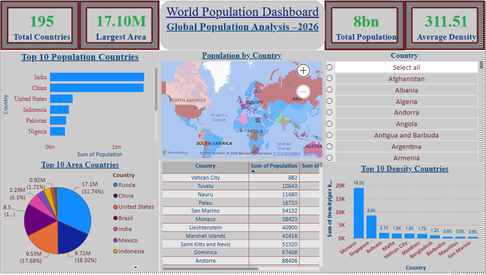
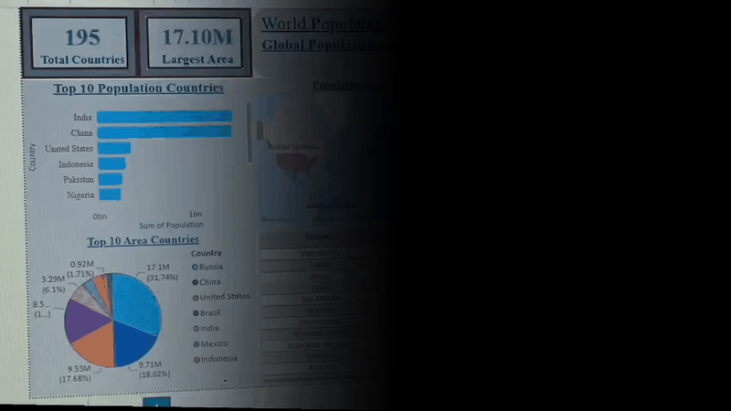
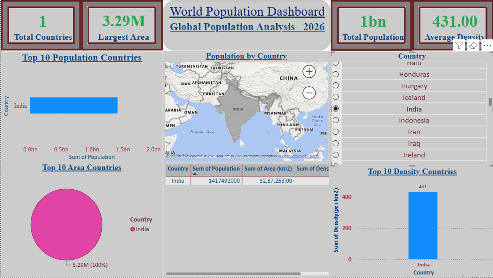
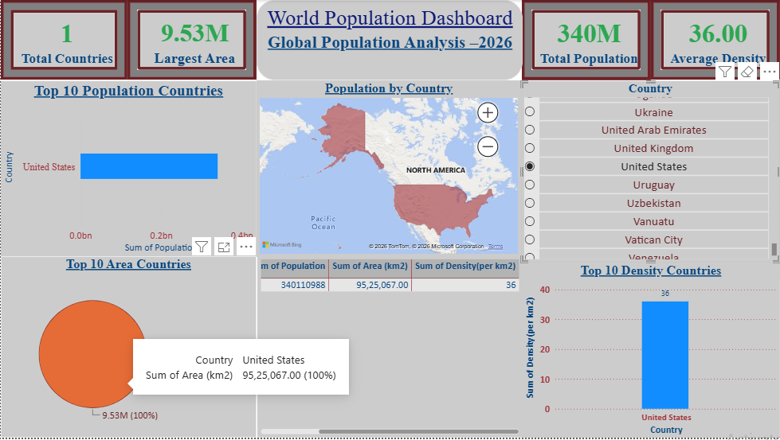
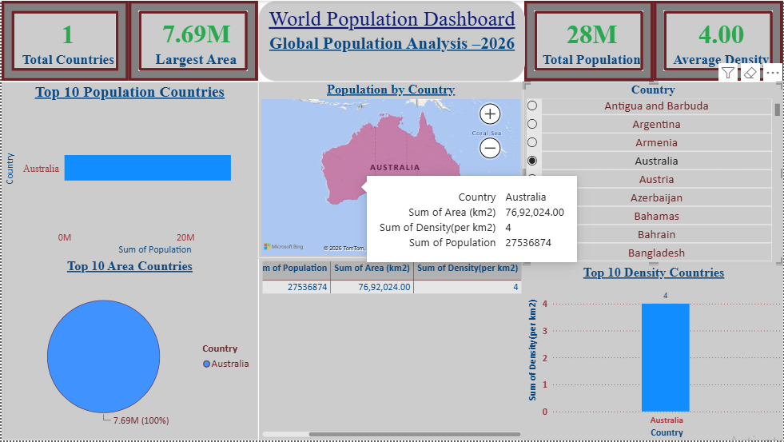
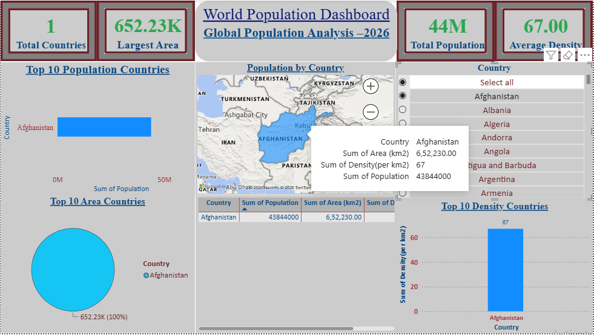

# 🌍 World Population Dashboard using Power BI

An interactive **Power BI dashboard** designed to analyze and visualize global population statistics. The dashboard provides country-wise insights into population, land area, and population density using interactive maps, KPI cards, charts, and slicers.

---

## 📌 Project Overview

This project transforms raw population data into meaningful insights using **Microsoft Power BI**. It allows users to explore and compare countries through dynamic and interactive visualizations.

---

## ✨ Features

- 🌍 Interactive World Map
- 📊 Dynamic KPI Cards
- 🔍 Country-wise Slicer
- 📈 Top 10 Most Populated Countries
- 🗺️ Top 10 Largest Countries by Area
- 📉 Top 10 Highest Population Density Countries
- 📋 Country-wise Data Table
- ⚡ Interactive Cross Filtering

---

## 🛠️ Tools & Technologies

- Microsoft Power BI
- DAX
- Power Query
- Microsoft Excel
- Bing Maps

---

# 🖼️ Dashboard Preview

### 🏠 Home Dashboard



---

## 🎥 Dashboard Demo

> Click the GIF below to watch the complete dashboard demo.

[](Demo/Demo.mp4)

---

# 🌏 Country-wise Analysis

### 🇮🇳 India



---

### 🇺🇸 United States



---

### 🇦🇺 Australia



---

### 🇦🇫 Afghanistan



---

# 📂 Project Files

| File | Description |
|------|-------------|
| 📊 **World_Population_Dashboard.pbix** | Power BI dashboard file |
| 📁 **World_Population_Dataset.xlsx** | Dataset used in the dashboard |
| 🎥 **Demo.mp4** | Dashboard demonstration video |

---

# 📈 Key Insights

- Compare countries based on population, land area, and population density.
- Explore global demographic data through interactive visuals.
- Dynamic filters update all charts, maps, and KPI cards in real time.
- Analyze country-specific insights using an intuitive dashboard interface.

---

# 📂 Repository Structure

```text
World_Population_Dashboard
│
├── Demo
│   └── Demo.mp4
│
├── Images
│   ├── Dashboard_Demo.gif
│   ├── Dashboard_home.png
│   ├── India.png
│   ├── Australia.png
│   ├── USA.png
│   └── Afghanistan.png
│
├── README.md
├── World_Population_Dashboard.pbix
└── World_Population_Dataset.xlsx
```

---

## ⭐ Support

If you found this project useful, consider giving it a **⭐ Star**.

---

## 👩‍💻 Author

**Diksha Gade**

BCA Student | Aspiring Data Analyst

**Skills:** Power BI • SQL • Excel • Java
